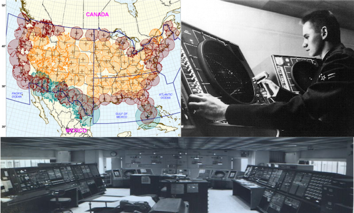

# What is C2
指挥控制（Command and Control, **C2**）是我们今天再熟悉不过的军事术语。其不仅代表了军事中的核心活动，也广泛体现在生产、管理以及日常生活中。

例如，军队中有各级各类的指挥所，企业有用于生产的指挥调度系统，政府有应急指挥中心。日常生活中，教练指挥比赛、交警指挥交通、指挥家指挥演奏等等。可以说，人类的群体性活动都离不开指挥控制。

另一方面，作为实现指挥控制的技术平台，各种指控系统（C2系统）不仅是计算机、网络、人工智能等先进技术应用的产物，也直接推动着技术的发展与革新。例如，第一套基于计算机的C2系统——赛其系统（[SAGE, Semi-Automatic Ground Environment](https://en.wikipedia.org/wiki/Semi-Automatic_Ground_Environment)），为了实现对苏联远程轰炸机的早期预警与拦截，首次将雷达与计算机通过电话线进行连接，导致了计算机广域网的出现，并催生了互联网的前身——APRNET。

>除了计算机网络外，SAGE系统还创新出了磁芯存储器、基于光笔及CRT的人机交互、软件工程等当今耳熟能详的技术，并催生了鼎鼎大名的MIT林肯实验室以及MITRE公司等重量级企业。SAGE系统被认为是计算机发展史上的一座丰碑，位于硅谷的计算机博物馆（紧挨谷歌公司总部）收藏了SAGE系统的部分设备，有机会一定要去膜拜一下。

指挥控制相关的例子、术语及概念演化请参考站内博文“[C2的概念及其演化](./C2_Concept.md)”。简单来讲：

“**指挥**”意为对下级行动的组织领导。指挥是系统的源动力，**基础**是法定或个人的威信，**核心**是决策、判断以及行动（作战）构想，**前提**是信息交互，**形式**既包括艺术，也涉及科学。

“**控制**”意为驾驭、支配、掌握，使不超出范围。从自动控制的角度看，**负反馈** 是实现控制过程的前提；从控制论的角度看，“**可能性空间**”是其最基本的概念。控制归根结底，是一个在事物可能性空间中进行有方向的选择的过程：
 - 了解事物面临的可能性空间是什么
 - 在可能性空间中选择某些状态作为目标
 - 控制条件，使事物向既定目标转化

（———参见金观涛《[控制论与科学方法论](http://product.dangdang.com/9014495.html)》）。

PLA军语将“指挥控制”定义为：“**指挥员及其指挥机关对部队作战或其行动掌握和制约的活动**”，美军及北约也有相应的定义（参见“[C2的概念及其演化](./C2_Concept.md)”）。

C2术语的出现体现了“指挥”、“控制”的结合，一方面体现了战争对战场硬件设施和技术的依赖性越来越强，另一方面也体现了由于战争活动中所涉及要素的复杂性增强，以至于对战场的集中控制成为必须。因此，C2是“战争机器”精确、快速、高效运作的需要，也是科学技术，特别是工业革命以来的科学技术在军事领域运用的产物。

对于两者的关系，我们有如下理解：

 - 从时序看，“指挥”必须为将要完成之事明确方向，并塑造系统的特征和本质，以便认识和塑造将要完成之事；而“控制”必须对正在完成之事进行清楚和毫不含糊的评估，并对过程进行修正。(**指挥控制必须允许人们指导和塑造将要完成之事，同时允许人们根据对正在完成之事的评估修正这种指导。——约翰.R.博伊德**)
 - 从特征看，“指挥”解决的是作战当中诸如谋划、决策等重大问题，是一种创造性很强的活动，因此具有更多的灵活性、策略性、艺术性。“控制”是把决心变为现实、逐步实现作战目标的具体措施和过程，具有创造性，但更富事务性、规范性、程序性和可操作性。

因此，有个形象的比喻：如果将兵力比作马，指挥比作骑手，控制比作挽具。

# 研究问题

C2的成效是胜负的决定性因素。在战争中，任何一项其它活动的重要程度都无法与指挥与控制相提并论。因此，C2相关的研究一直是军事、管理、理论研究中最活跃的领域之一。

跨学科特点：。。。

我们将所关心的C2问题划分为“理论”、“技术”两大类型。“理论”侧重对基本原理的研究，主要包括C2的领域、模式、过程、方法、组织设计等问题，“技术”侧重对从数据到行动的闭环中各类技术问题的研究，可大致归结为态势认知、任务规划两类，如下图所示。

## C2理论

20世纪90年代以来，新一轮以信息化为标志的军事变革掀起了以消除各军兵种“烟囱系统”、建立指挥系统之间的“互联、互通、互操作”为目的的C2系统发展高潮。C2迅速从单纯的C2演化到 C3I、C4I、C4ISR等等，技术元素与功能形式等越来越多，结构与过程越来越复杂，涉及到的人、信息与结构及其对象等指挥与控制要素都发生了发生深刻变化。**智能** 技术的迅速兴起又给C2注入了新的发展动力，以智能化为特征的C2系统成为未来发展的重点，整个领域面临着一场深刻的变革。在信息与智能时代，C2可以突破传统的统一指挥、统一意图、等级组织、直接控制等方式，并表现出不确定性、动态性、随机性、涌现性、非线性等特点。

这些变革，都触及到C2的本质——结构与过程、决策与智能等基础理论问题。就像牛顿发现万有引力之前我们看待苹果落到地上，对现象的漠视往往是我们认识科学掌握真理的桎梏。尽管不乏有真知灼见的观点和宏篇巨著探索了C2相关的理论问题，也有从战术到战略C2系统的设计与运用，但关于C2本质的认识仍然缺乏从现代科学（系统论、控制论、信息论等）的角度进行深刻的剖析，诸多C2系统设计与使用仍然没有突破工业时代机械化战争的思维模式的限制。

因此，重新认识和理解C2成为一项十分迫切的重要任务。对C2本质的认识，需要从源头探究其基础理论的发展，以新的技术、新的使命与任务为出发点,建立新的C2基础理论。

我们认为，C2的基础理论问题主要包括以下几个方面：
 - 如何从复杂性角度构建指挥与控制的基础理论？
 - 如何建立指挥与控制在物理、信息、认知、作战等多域的交互模型？
 - 面向敏捷性的指挥与控制方式应该如何设计？
 - 指挥与控制要素如何组织与优化？
 - 指挥与控制的运行过程是什么？
 - 指挥与控制的有效性如何测量和评价？

>有关以上问题的整体性简要描述请参考“[信息与智能时代指挥与控制基本理论问题](https://mp.weixin.qq.com/s/sfib0Opef_FxsoY-j8Cbyw)”）。

## C2技术

指控技术可以形象地理解为“知而后行”。“知”对应态势认知技术，“行”对应任务规划技术。
“知易行难”，“知难行易”。。。其实都难。难在哪里？

### 态势认知

态势:

态势认知：
 - 目的：看清（客观）、辨明（主观）
 - 过程（JDL/SA）
 - 挑战（难点）：

主要问题
 - 目标识别（画像/行为分析）
 - 结构还原
 - 意图理解/威胁分析
 - 目标选择

### 任务规划

# 如何开始

# 关于我们
  **C2 Group** in Science and Technology on Information Systems Engineering Laboratory, National Unversity of Defense Technology.

 - [Projects](./Projects.md)
 - [Publication](./Publication.md)
 - [Talks and Presentations](./Talks.md)
 - [Dataset and Codes](./Dataset.md)
 - [News and Events](./News.md)
 - [Resources](./Resources.md)
