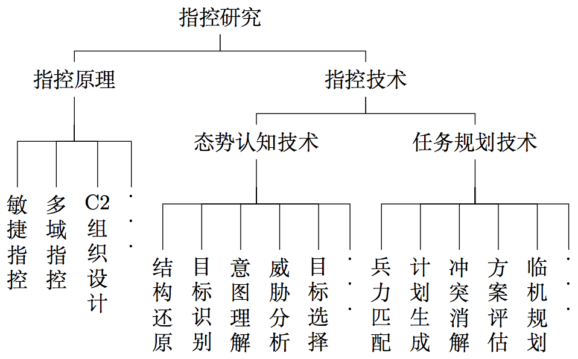

# What is C2
指挥控制（Command and Control, **C2**）是我们今天再熟悉不过的军事术语。其不仅代表了军事中的核心活动，也广泛体现在生产、管理以及日常生活的各个方面。例如，军队中有各级各类的指挥所，企业有用于生产的指挥调度系统，政府有应急指挥中心，日常生活中教练指挥比赛、交警指挥交通、指挥家指挥演奏等等。可以说，人类的群体性活动都离不开指挥控制。指挥控制相关的例子、术语及概念演化请参考站内博文“[C2的概念及其演化](./C2_Concept.md)”。简单来讲：

“**指挥**”意为XXX。。。指挥是系统的源动力，**基础**是法定或个人的威信，**核心**是决策、判断以及行动（作战）构想，**前提**是信息交互，**形式**既包括艺术，也涉及科学。

“**控制**”意为驾驭、支配、掌握，使不超出范围。从自动控制的角度看，负反馈是控制的核心概念；从控制论的角度看，“可能性空间”是其最基本的概念（参见金观涛《[控制论与科学方法论](http://product.dangdang.com/9014495.html)》）。反馈、可能性空间的解释。。。

指挥、控制的结合，即C2，是“战争机器”精确、快速、高效运作的需要，也是科学技术，特别是工业革命以来的科学技术在军事领域运用的产物。PLA新版的军语将“指挥控制”定义为：“**指挥员及其指挥机关对部队作战或其行动掌握和制约的活动**”。

对于两者的关系，我们有如下理解：

 - 从时序看，“指挥”必须为将要完成之事明确方向，并塑造系统的特征和本质，以便认识和塑造将要完成之事；而“控制”必须对正在完成之事进行清楚和毫不含糊的评估，并对过程进行修正。(**指挥控制必须允许人们指导和塑造将要完成之事，同时允许人们根据对正在完成之事的评估修正这种指导。——约翰.R.博伊德**)
 - 从特征看，“指挥”解决的是作战当中诸如谋划、决策等重大问题，是一种创造性很强的活动，因此具有更多的灵活性、策略性、艺术性。“控制”是把决心变为现实、逐步实现作战目标的具体措施和过程，具有创造性，但更富事务性、规范性、程序性和可操作性。

因此，有个形象的比喻：如果将兵力比作马，指挥比作骑手，控制比作挽具。

C2最直接的体现是各类C2系统。现代意义上的C2系统的鼻祖公认为SAGE系统。这套系统。。。

# 研究问题
我们将所关心的C2问题划分为“理论”、“技术”两大类型，“理论”研究侧重...“技术”研究侧重。。。。如下图所示。

## C2理论
对于它在军事领域的存在没有人质疑其重要性和不可或缺性，在军事行动上实施指挥控制任何理性的人都会认为是理所当然，就像牛顿发现万有引力之前我们看待苹果落到地上。然而，对现象的漠视往往是我们认识科学掌握真理的桎梏。自C2见诸于军事领域以来，不乏有真知灼见观点和宏篇巨著的研究文献探索C2的相关问题，也有从战术到战略C2系统的设计与运用，但关于C2本质的认识仍然缺乏从现代科学（系统论、控制论、信息论等）的角度进行深刻的剖析。诸多C2系统设计与使用仍然没有突破工业时代机械化战争的思维模式的限制。

我们认为：重要的C2理论问题包括：
 - 敏捷
 - XX
 - XX

 具体参见[智能与信息时代的。。。]()

## C2技术

指控技术可以形象地理解为“知而后行”。“知”对应态势认知技术，“行”对应任务规划技术。
“知易行难”，“知难行易”。。。其实都难。难在哪里？

“知行合一”  陶行知。。。

### 态势认知

态势:

态势认知：
 - 目的：看清（客观）、辨明（主观）
 - 过程（JDL/SA）
 - 挑战（难点）：

主要问题
 - 目标识别（画像/行为分析）
 - 结构还原
 - 意图理解/威胁分析
 - 目标选择

### 任务规划

# 如何开始

# 关于我们
  C2 Group in Science and Technology on Information Systems Engineering Laboratory, National Unversity of Defense Technology.
