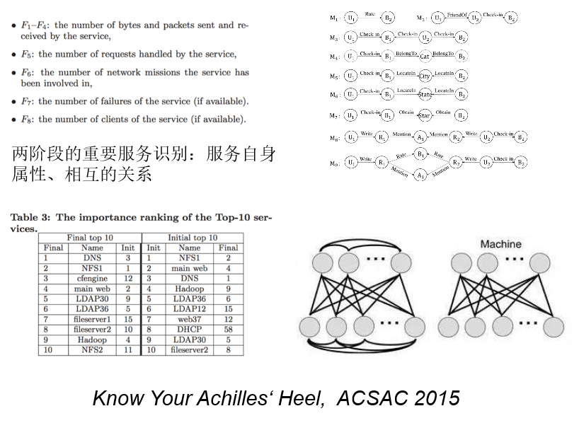
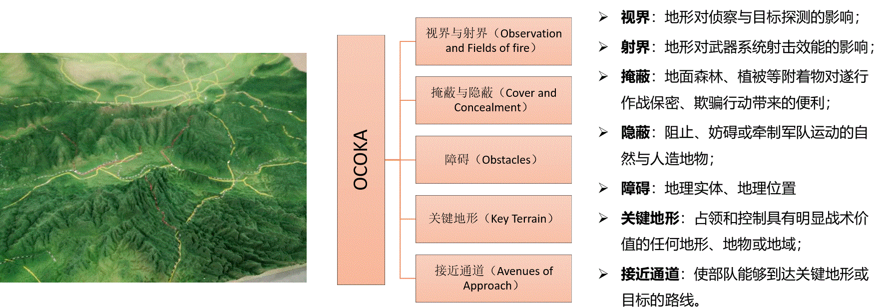
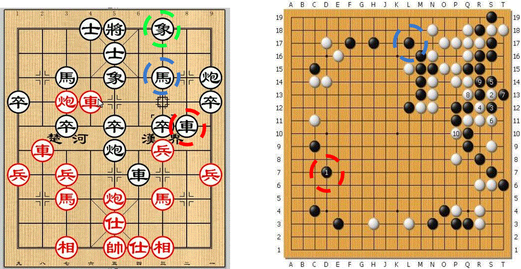

# 态势认知——判断

## 问题概述

在还原、理解的基础上，需要对观测对象的关键点、脆弱点进行判断。关键点可以从正向理解，即对于系统维持功能重要的点（集合），脆弱点则可以从反向理解，即对于破坏系统功能，导致崩溃重要的点（集合）。在某些情况下，两者有可能相同。

### 关键点判断

网络中的关键点涵盖关键服务、关键数据、关键用户、关键地形等多种形态。

- **关键服务**

例如，有研究曾通过采集的网络数据，构建出网络服务之间的依赖关系，并判断出其中的关键服务。

- **关键数据**

对于组织而言，最重要的网络资产是数据形态的代码、文档、数据库记录等，一旦泄露将引起重大的损失。而数据变形多、变化快，流转路径多，淹没于海量大数据中，如何有效的发现、追踪关键数据，是一个重要而又有挑战性的问题。RSAC 2018创新沙盒冠军产品[BigID](https://bigid.com/)就是一款通过机器学习方法有效发现、识别隐私数据的产品，受到业界的极大关注。

- **关键用户**

对于网络中关键用户的判断也是很有特色和价值的问题。例如，在轰动一时的[Facebook与剑桥分析公司事件](https://www.nytimes.com/2018/03/19/technology/facebook-cambridge-analytica-explained.html)中，剑桥分析公司受雇于特朗普2016竞选团队，通过搜集到的超过5000万Facebook用户的发帖、点赞数据，基于心理学模型和大数据方法，分析了美国选民的政治倾向，其结果被用于精准投放选举广告，影响美国总统大选。

- **关键地形**

美网空作战条例JP3-12中反复提到“网络空间关键地形（Cyber Key Terrain， CKT）”，借鉴了陆地环境中“地形”的概念，认为对CKT的识别是支撑网络空间行动的重要问题。美陆军曾提出了OCOKA模型，从视界、射界、隐蔽、障碍、接近通道等多个维度提供对地形关键性的判断与度量。

JP3-12中指出：
> 网络空间内的关键地形类似于物理域中的关键地形，因为它使得任何战斗人员都拥有明显的位置优势。在网络空间中，可能只需要在特定地点或特定过程中保持安全存在，而不是夺取和扼守所有其他地方。美国和敌手都可能占据网络空间内相同的地形或使用相同的流程，并且可能不知道对方的存在。网络空间地形的另一个特征是，这些地方有一个虚拟的组成部分，可以在逻辑网络层或者甚至是网络角色层中进行确定。关键的地形识别是计划工作的基本组成部分。军事地形(障碍物、接近路、掩护和掩蔽、观察和射界、关键地形)提供了一种构想和描述网络地图的方法。网络空间中的障碍物可能包括防火墙和端口模块。“接近路”可以通过识别将节点和链接进行分析，这些节点和链接可以将终点连接到某个具体站点。“掩护和掩蔽”可能涉及到隐藏的IP地址或受密码保护的访问。“观察和射界”是指可以监测、截获 或记录网络流量的区域。网络空间内潜在关键地形的例子包括主要通信线路(LOC) 的接入点、观察来袭威胁的关键路径点、网络空间攻击的发射点，以及与连接到国防部信息网络的重要资产有关的任务相关网络空间地形。......将计划或任务目标与关键地形相关联可确保查明任务在网络空间中的依赖性，并在国防部范围内采用标准方式进行优先保护。在许多情况下，为任务目标提供支持的系统、网络和基础设施将是相互依赖的。这些复杂的相互依赖关系可能需要进行深入分析，从而提出定制的风险化解方法。 

因为网络空间的虚拟性、多变性，使得关键地形的判断更类似于围棋而非象棋。围棋中的每一个棋子都可以随时成为重要的棋子，取决于盘面整体；而象棋中的每一个棋子都有明确的角色和动作规则。如何根据整体态势来判断虚拟、多变的网络空间中的关键地形，是一个极具挑战性，需要想象力的原创性问题。

### 脆弱点判断

任何一个漏洞，都可能是撕破体系的关键点。美军提出“五环理论”，通过考察军事、政治、经济、基础设施、社会等五个维度的影响关系，找出对方体系的重心，为目标选择提供依据。

在网络空间中，脆弱点的形态可以是处于网络核心结构的点/边（如交换节点、边界节点等），可以是承载重要功能的点（如中枢指挥所、域控服务器），也可以是在网络域、物理空间或者其关联关系上有漏洞的点，除了以上物理节点/链路外，脆弱点还可能是网络中的某个虚拟的用户账户、应用系统或者网站等虚拟目标。

例如，在复杂网络领域，有大量研究聚焦于网络的级联失效过程，通过建立级联失效的动力学模型，来辨识网络中的脆弱点。

网络阻断（Network Interdiction）从博弈角度建立网络攻守双方对抗模型，攻方通过阻断网络中的点、边使得网络最短路或最大流等指标尽可能的恶化，守方则通过加固、重路由等行为进行对抗，尽量维护网络的性能。对于阻断点、边集合的计算通常被建模为 $max-min$ 双重规划问题。

<!-- 
具体包括：
1. **相互依赖网络建模**
 - 无论是传统战场作战空间，还是未来多域融合的跨域作战空间，目标网络均呈现出虚拟结合、跨域铰链的特点，如何更为准确的描述目标网络中层内、层间依赖关系，是进行识别重心的前提。
 - 如何描述网络的动态适应特性，如网络中的备份关系、备份节点等动态适应特征？
 - 如何将网络描述转换为可计算的数学模型？

2. **结构模式分析**
 - 网络中的信息流方式是产生能力的基础，传统的频繁模式只能刻画节点间的线性序列关系，对于多层异质目标网络，有效的行为模式通常包含循环、子图等复杂样式，如何提取此元图模式([Meta-Graph](https://github.com/HKUST-KnowComp/FMG))？
 - 网络中的行为在数据流中通常是由多个基元模式组合而成，研究如何识别网络中通常出现的基础流量特征，以此为基础建立复合业务行为表示模型？
3. **级联失效性分析**
 - 如何描述节点/关系失效后对网络结构的影响？
 - 如何描述节点/关系失效后对网络功能的影响？
 - 在给定约束条件下（如成本、目标效果），如何筛选最优目标集合？ -->

## 研究选题
 - [关键数据资产识别](./SA_Identify_Data.md)
 - [纵深防御与网络阻断](./SA_Identify_Interdiction.md)
 - [跨域多层依赖网络建模与表示](./SA_Identify_MultiLayer.md)
 - Meta-Graph行为模式分析
 - 基于级联失效模型的网络重心识别
