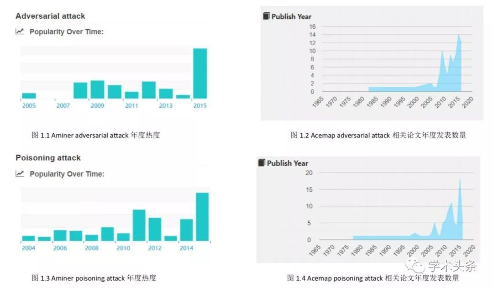

# 态势认知——理解

## 概述

随着网络入侵行为趋于规模化、复杂化、间接化，国家间信息对抗形势逐渐严峻，对网络安全技术提出了更高的要求。与对已产生的攻击行为进行取证和控制相比，态势认知和意图推断技术能够主动地收集动态的网络态势信息，分析并准确预测帮助管理员做出准确防御和应急性决策，具有重要的意义。意图推断与意图识别意义相近，最早来源于人工智能领域中的计划识别(Plan Recognition)。计划识别是人工智能领域中被广泛研究的内容，最早的研究是基于规则的推断系统。计划识别被用于进行agent行为意图的识别，是通过对agent的行为进行观察来推断agent的目的，可以分成两大类：keyhole recognition和intended recognition，前者agent不知道自身的行为在被观测，后者中agent会执行有利于其计划被识别的行为。在网络安全领域，意图推断可以帮助管理者对可能发生的网络攻击进行及时的感知，并采取措施进行应对，常用于风险评估中。常见的意图推断模型有攻击树、攻击图、贝叶斯网络等。

攻击树模型最早是基于故障树模型的概念提出的。攻击树中的叶子节点表示攻击方法，根节点表示了攻击者的目标。攻击树中的节点分为AND节点和OR节点，其中AND节点表示只有所有孩子节点都实现，父节点才能实现，OR节点表示任意一个孩子节点实现了，父节点就可以实现。但是，攻击树在刻画攻击者的攻击路径时确定性较强，当攻击者在某次攻击中改变攻击手段时，攻击树往往会失去作用。

攻击图与攻击树相似，以有向图的方式来表答攻击者利用存在的脆弱性对网络或信息系统进行攻击的所有可能的攻击路径，全面的反映了网络或信息系统中脆弱点利用之间的依赖关系。攻击图自身不能对不确定性进行表示，因此结合贝叶斯网络形成贝叶斯攻击图是研究的热点，例如杨宏宇等提出了一种基于攻击图的多Agent网络安全风险评估模型，利用多个agent进行信息搜集来对攻击者的意图进行推断；高妮等提出了一种基于贝叶斯攻击图的动态安全风险评估模型，考虑了攻击图节点的资源属性，根据攻击者的实际攻击对后验风险进行推断；陈小军等在攻击图模型中引入了转移概率表，用其刻画单步攻击检测结果的不确定性，使推断结果更加符合实际。

贝叶斯网络是进行推断的重要工具。贝叶斯网络是一种用于描述变量间不确定性因果关系的图形网络模型，由节点、有向连线和条件概率表组成，其中有向连线代表节点间的因果依赖关系。贝叶斯网络的构建可由专家完成，在具有足够数据的情况下可以通过结构学习算法获取。常见结构学习算法分为三类：基于约束的算法，基于评分搜索的算法和混合算法。除了三类主流算法之外，还有动态规划结构学习、模型平均结构学习和不完备数据集的结构学习等算法。

现有的推断算法来源可以大致分为两种，一种从攻击图或是攻击树等常规图模型而来，利用现有的结构和定义的概率进行风险的计算，并根据攻击者的攻击行动是否被检测来对攻击者采用某一攻击路径的后验概率进行推断；另一种是贝叶斯网络而来，将贝叶斯网络中的推断算法应用到现实的问题中去。基于贝叶斯网络的推断算法是目前推断算法的主流，贝叶斯网络。贝叶斯推断算法主要可以分为两大类：精确推理算法和近似推理算法，前者主要用于网络规模较小、节点较少、关系不是很复杂的网络上。

## 研究选题

## 1、内部威胁感知与意图推断 ##

近年来，斯诺登、曼宁等泄密事件证明，“人”的行为是网络空间安全问题的关键要素，网络空间的安全威胁将主要源于内部，特别是拥有合法权限的内部人员的恶意攻击和窃密行为，然而传统的安全方法没有考虑，也无法分析具有合法权限内部人员的恶意行为。因此，在动态、多域条件下的网络空间用户行为分析至关重要，否则将造成网络防御的巨大漏洞。贝叶斯网络可以较好的应用在态势感知以及行为分析问题中，但是在应用过程中，如何根据已有的数据和知识，构建网络有向无环的拓扑结构（Directed Acyclic Graph，DAG）和节点间条件概率影响程度（Conditional Probability Table，CPT），即贝叶斯网络学习，具有很强的挑战性。这是因为，在学习过程中，由于候选DAG结构的数量会随着节点数的增加而指数倍增加，因此BN学习是NP难问题。在实际应用中，模型的构建需要考虑数据和领域知识的结合，且搜索空间庞大，因此传统的贝叶斯网络研究，特别是模型学习研究在最近几年出现了一定的停滞。具体地，本课题以网络空间内部威胁检测为背景，以提高贝叶斯网络学习精度为目标，在现有单任务（单问题域）学习算法的基础上，通过引入多任务（多问题域）的学习框架，研究多任务条件下任务相似度计算、任务求解、以及支持知识和数据混合下学习的实现途径。研究贝叶斯网络对领域知识和用户行为的建模方法，在已有指标的基础上，结合心理域与社会域，建立了预测网络中恶意用户动机和心理。研究多任务条件下贝叶斯网络的近似推理算法，以及关键证据集的分析方法，并结合内部威胁检测应用，构造综合考虑学习算法性能和实际应用绩效的评价体系，通过公开模型数据集和实际应用实验，探索多任务条件下的模型学习有效模式，以及学习任务、领域知识和算法效能之间的关系，为不确定环境下态势感知系统的分析和设计提供理论与方法支撑，为安全防护决策提供支持。

## 2、对抗条件下的威胁检测与判断 ##

目前的威胁检测准确性，从过去的40-50%提升到70-80%。再往后，对抗强度提升，真正的高级威胁周期很长，机器学习模型如何应对这种挑战？目前对抗条件下的机器学习问题处于寻找新应用场景和不断尝试新算法的阶段，还未形成完整体系。和攻击与生俱来的还有防御问题，现阶段防御问题基本还处于把对抗样本加入原始数据一起训练以此来防御攻击的状态，研究的人很少，也没有十分显著的效果。说明在这个领域还有很大的可挖掘的空间。在机器学习发展飞速的今天，安全性问题正逐渐进入人们的的视野，对抗攻击不只能够在网络空间进行攻击，还能够在物理世界中任何使用到机器学习的场景中进行有效攻击，比如针对人脸识别、语音识别的攻击。因此该方向的研究具有重要的前沿性和巨大的应用价值。

以 adversarial attack和意思相近的poisoning attack 等词作为关键词，在国内著名学术搜索网站 AMiner 和 Acemap上搜索相关论文，以下是两个网站给出的论文数据分析图表。可以看出adversarial attack相关的论文显著增多。说明在机器学习发展飞速的今天，机器学习安全问题逐渐被研究者们所重视。这个方向在未来几年应该会是一个新兴的热点。

根据调研，对抗攻击在网络安全、视觉、文本理解等应用场景中均有应用，现阶段所发掘的只不过是冰山一角，在这个领域，还有很多很多应用场景可以进行研究。因此，仅从应用场景而言，对抗攻击绝对是最近几年最具潜力的方向。

## 3、安全风险评价与BN结构理论研究 ##

风险分析（Risk Analysis）与风险评估（Risk Assessment）在很多文献中被认为是相同含义。在对于信息系统的风险分析是指评估在计算机系统和网络中每一种资源缺失或遭到破坏对整个系统造成的预计损失数量，是对威胁、脆弱点以及由此带来的风险大小的分析。常用的分析方法有定量分析、定性分析和半定量分析。

定量分析（Quantitative Analysis）通常依赖于对不确定事件的统计分析，灵敏度分析、蒙特卡洛模拟、失效模式分析等方法是定量分析的常用方法。在定量分析中，常常对一个风险事件及相应措施进行效益-成本分析（cost-benefit analysis），将一个事件及措施的发生概率、结果、损失等进行定量表示，从而可以为最终的收益或损失给出一个定量化的参考。在定性分析（Qualitative Analysis）中，分析者多依赖对事件的直接判断而不是统计数据，其会根据事件的波及范围、持续时间等给出相应的威胁程度和应对措施描述。半定量分析（Semi- quantitative Analysis）是定性分析和定量分析的结合，通过构建一系列的规则和方法，当事件发生时，根据相应的规则和方法对其威胁程度、损失等进行赋值，是目前应用最多的分析方法。

借助以上方法，可以构建对信息系统遭受攻击的风险进行分析。目前，从系统本身存在风险出发对信息系统可能遭受的攻击风险进行分析是主要的分析方法[38]，漏洞对系统本身进行风险分析的重要来源，已经被研究者们多次利用和提及。CVSS评分是重要的分析指标，是最常见的分析依据。与此同时，也还有很多其他分析指标及方法。

在对一个信息系统遭受Web攻击的风险进行分析时，常规的做法是利用漏洞扫描器对信息系统本身存在的漏洞进行扫描，这种方式使用简单，但是存在一定的问题：（1）攻击者进行的尝试没有被考虑进来（2）扫描器通常不会包含最新发现的漏洞。要考虑攻击者的尝试，就有必要对攻击者进行的攻击进行有效的检测。面对网络攻击，传统的防护手段主要依靠基于主机或网络的IDS（Intrusion Detection System，入侵检测系统），多半是对病毒木马或是来自于网络层的攻击进行防御。随着Web技术从1.0发展到2.0，Web攻击已经从网络层上升到应用层，传统IDS在面对新的攻击时显得力不从心，多样化的攻击变式使基于规则的防御难以应对。机器学习为检测攻击提供了有效的数据驱动的方法，然而目前的研究者提出的很多检测方法都是黑盒模型（black-box model），其对于结果难以给出实际意义的解释。在课题中，以贝叶斯网络这一白盒模型作为基础分类器来进行集成学习，并给出节点重要性的排序方法来对结果进行解释，使信息系统在遭受攻击时可以进行及时的检测记录，同时使用者可以利用白盒模型对给出的结果进行解释。而对于漏洞来说，新出现的漏洞在扫描器中通常不会被收录，或者即使收录也难以给出一个合理的威胁程度评估，因此本文提出用文本挖掘的方式根据漏洞描述来对其威胁程度进行智能评估。

这里的BN模型是一种常用的安全风险评价模型，其难点在于结构学习。现有优化方法的弊端在于不能有效达到无环性约束，无约束算法，如梯度下降法，显然不能达到这个约束条件。由于无环性约束是非凸的，不能准确定义投影算子，因此投影方法不能充分解决这一问题。我们需要研究专门的优化方法来有效达到无环性约束。现有的方法包括分支-切割法、动态规划法、A*搜索法、贪心算法、坐标下降法等。目前在不同结构和统计假设的情况下学习DAGs的算法都取得了很大的进步。从现有的所有机器算法中我们可以看出，这些模型的成功之处在于都具有一个封闭的形式、对于现有优化技术来说容易处理。对于无向图来说主要的技术是凸优化。可是DAG学习算法显然不能直接使用这些优化算法，因为它涉及的问题是不易处理的。这就导致了启发式算法的大量应用，总是从优化方法中提取工具，但还是要依靠启发式方法来给算法提速。广泛的来说，现有方法可以分成估计算法和精确算法，后者能够保证返回一个全局最优解。精确算法能够形成一类方法，但它们都是围绕着NP难的组合优化问题，这些方法在计算普遍不容易实现。可以说目前最流行的优化方法都包括局部搜索，也就是边和父节点集都是有序增加，一次只增加一个节点。只要每个节点只有少量的父节点时，这种方法就是有效的。但随着可能的父节点数增加，局部搜索很快不易处理。此外，这种策略非常依赖严格的结构假设，显然这些严格的假设难以达到并且不可能验证。因此，找到能够进行全局搜索的算法也是个关键的研究点。关于DAG学习的文献可以划分为在离散数据上处理和在连续数据上处理。许多方法仅能够在非常特定的数据上有效，因此找到不依赖于特定模型假设的一般方法也是个重要的研究点。本课题以贝叶斯网络的结构学习为主要研究内容，以安全风险评价为研究目标，在现有局部启发式算法的基础上，引入数值优化的相关知识，研究能够对DAG结构进行全局最优学习的算法，最后将其用于安全风险评价。

## 4、漏洞预测与系统威胁评估 ## 

漏洞（vulnerability）是指在硬件、软件、协议的具体实现或系统安全策略上存在的缺陷，从而可以使攻击者能够在未授权的情况下对信息系统进行访问或破坏。漏洞一直是威胁信息系统安全的重要因素，层出不穷的漏洞对社会经济和大众隐私造成了巨大的威胁。随着代码规模的巨大化及逻辑的复杂化，漏洞的曝光频率越来越高，而不同漏洞对于信息系统的影响是不同的，有些漏洞被曝光后会被开发者忽略，而有些会被高度重视并及时修补。机器学习方法是在漏洞研究领域被应用的一类重要方法，其和文本挖掘的组合为研究者对漏洞进行评估分析提供了有力的支持。Hovsepyan等对利用JAVA写成的程序的源代码进行分析，构建可以表征源代码的词向量，并将这些词向量与相应的漏洞存在情况相对应，采用SVM等分类器来判断源代码中是否含有漏洞；Yamamoto等将LDA、SLDA等模型应用在爬取的NVD数据中，利用这些模型对爬取下的文本进行主题的提取，并利用提取的主题来对漏洞的特性进行描述。

本项目根据漏洞的文字描述，利用文本挖掘的方法提取其中的关键词，将高频词汇统计数及利用PCA对稀疏词汇降维的结果合并作为特征，构造可以将漏洞描述进行定量化表示的特征向量。利用从漏洞库中获取的XSS漏洞数据在多种分类算法下训练CNN模型进行实验，证明本方法在漏洞威胁程度评估方面的有效性。本项目在网络安全方面具有较高的学术价值和较宽广的应用前景，可以为漏洞分析、预测以及评估提供重要的参考价值和一定的研究思路。本项目的研究目标主要针对如何根据对于漏洞的简短描述来智能预测该漏洞的威胁程度。技术路线包括，对漏洞库中的某型漏洞的描述数据及其威胁程度进行爬取；利用文本挖掘的方法和主成分分析构建可以反映漏洞描述的特征向量；进行CNN机器学习分类器的训练；进行原型系统的设计制作本项目所提方法及案例进行实际应用，并在内网真实环境进行原型系统的实验。

## 5、研究资源 ##

- 在实际应用中，单纯依赖机器学习模型进行检测而忽视威胁情报会为攻击者的攻击埋下隐患。网络威胁情报（Cyber threat intelligence，CTI）是对传统网络安全的重要补充，对于研究人员来说，其可利用的威胁情报主要从开源网站上进行获取，这类威胁情报可以粗略划分为四种：IP地址信息、域名信息、漏洞数据库和开源情报信息库（例如有关安全的博客和论坛等）。在攻击检测过程中，可以直接自动化利用的是恶意IP地址库和恶意域名库，分属于粗分类的前两种。

- 恶意IP地址库是研究人员最容易获得的威胁情报之一，这些威胁情报被用于浏览器的访问黑名单中，当客户端发出的请求中包含这些地址时，浏览器便会进行阻拦。有很多公开网站发布恶意IP列表，其中，FireHOL 维护的恶意IP库是一个非常好的选择。FireHOL本身是Costa Tsaousis开发的用来对Linux内核防火墙的netfilter中IP表进行定制的一种shell脚本，其开发者提供了一个良好的恶意IP地址库，主要由四个来源的IP地址构成：fullbogons，出现在这些IP地址列表中的IP通常是DDOS攻击的来源，因此在一个路由器的路由表中这些地址不应该被添加进去；spamhaus drop and edrop，这个列表中包含了被专业的网络犯罪行动和钓鱼邮件使用后遗留下的IP；dshield，该IP地址包含了近三天排名前20的C类IP地址的攻击源IP；malware lists，顾名思义，是那些恶意软件或木马的常用网址。该综合IP地址库上的IP源地址会实时更新，并可以进行下载来对内部的应用IP地址库进行补充。

- 恶意域名库主要用于对僵尸网络、钓鱼页面和恶意软件进行防范。当一个用户访问的页面地址被包含在恶意域名列表中时，为用户安全考虑会对用户告警。很多网站都维护有向大众公开的相应的恶意域名库，在研究中可以从这些公开网站上获取相应数据。例如，PhishTank 是一个包含了众多钓鱼网址的网站，其由企业家David Ulevitch于2006年10月创办，是其主公司OpenDNS的一个分支，其主公司会利用自己开发的一套系统对用户请求检测的网站进行检测，并根据用户的投票来判断此网站是否为钓鱼网站，PhishTank上的大量记录由此而来。除此之外，还有DNS-BH project 、Malware Domain List等网站也提供了大量恶意域名信息。

- 常用的网络节点重要性排序指标有：度值、介数、接近中心性、k-壳值和特征向量等。其中，度值排序是一种局部排序方法，即网络中一个节点的度值越大则该节点越重要；介数是以经过某个节点的最短路径数量来评估节点重要性的方法，即经过某节点的最短路径数越多，该节点重要性越大；节点的接近中心性为节点与网络中其他节点距离平均值的倒数，即节点接近中心性越大则该节点越重要；k-壳分解是一种对网络中节点重要性粗粒化划分的方法；特征向量的基本思想为：网络中节点的重要性既与节点的度值大小有关，同时也与邻居节点的重要性有关。
- [https://en.wikipedia.org/wiki/Credal_network](https://en.wikipedia.org/wiki/Credal_network)
- Cozman F G. Credal networks[J]. Artificial Intelligence, 2000, 120(2):199-233.
- Vergari A, Mauro N D, Esposito F. Simplifying, Regularizing and Strengthening Sum-Product Network Structure Learning[C]// Joint European Conference on Machine Learning & Knowledge Discovery in Databases. 2015.

- 由于目前已有大量的贝叶斯网络学习研究，以及相关数据和构建好的实际应用模型，我们将利用这些公开的数据进行学习，并与实际模型相比较，从而对本项目的算法以及公开发表算法进行评价。比较有名的公开数据集包括：牛津大学的BN Learn（[http://www.bnlearn.com/](http://www.bnlearn.com/)），澳大利亚人工智能协会的ABNMS数据集（[http://abnms.org/bnrepo/](http://abnms.org/bnrepo/)），以色列希伯来大学的BN Repository（[http://www.cs.huji.ac.il/Repository/](http://www.cs.huji.ac.il/Repository/)），NORSYS软件公司的Net library数据集（[http://www.norsys.com/netlibrary/](http://- www.norsys.com/netlibrary/)），以及HUGIN公司的BN Forum数据集（[http://forum.hugin.com/](http://forum.hugin.com/)）等。

- 可以基于这些通用数据集中的贝叶斯网络模型，进行编程实验，并将软件工具包BNT（Bayes Net Toolbox for Matlab）集成到开发环境中，通过从真实模型中采样得到训练用目标数据集，通过引入一定的噪声采样产生源数据集，以便于进行多任务和迁移学习，实试验算法均在不同样本数据集上独立运行 100次进行测试。 在得到学习结果后，对不同学习算法进行评价，包括计算实验得到的网络与真实网络的结构编辑距离（将算法确定的最优图结构转化为标准的网络结构所需要的平均运算总数目），以及参数的K-L散度（Kullback–Leibler Divergence，用于计算概率分布之间的距离）等。

